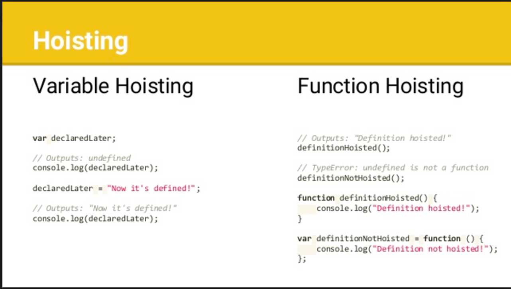

 
 
 
 # What is Hosting in JS?
 ## In JavaScript, Hoisting is the default behavior of moving all the declarations at the top of the scope before code execution. Basically, it gives us an advantage that no matter where functions and variables are declared, they are moved to the top of their scope regardless of whether their scope is global or local.
 
 
 
 
 

    <h1 style="text-align: center; font-size: 40px;">Hoisting in javascript</h1>

 
Hoisting isa JavaScript mechanism where variables and function  
        declarations are moved to the top of their scope before code  
        execution.  
          
        Hoisting in JavaScript isa behavior in which a function or a variable
        can be used before declaration.

# Hoisting – function declaration
## Hoisting is JavaScript's default behavior of moving all declarations to the top of the current scope (to the top of the current script or the current function).

# Temporal dead zone, letand const
## A variable declared with let , const , or class is said to be in a "temporal dead zone" (TDZ) from the start of the block until code execution reaches the place where the variable is declared and initialized.

